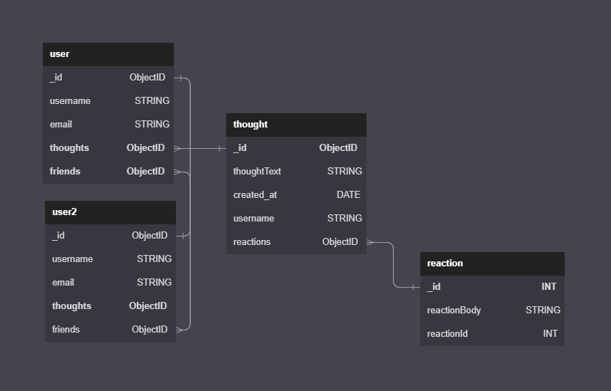

 # 18_Social_Network_API_NN
NoSQL: Social Network API

## The Challenge
MongoDB is a popular choice for many social networks due to its speed with large amounts of data and flexibility with unstructured data.
Our Challenge is to build an API for a social network web application where users can share their thoughts, react to friends’ thoughts, and create a friend list. We’ll use Express.js for routing, a MongoDB database, and the Mongoose ODM.

## Installation

Before running the application, insert database by running the following commands in the MySQL shell (make sure navigation is in the root directory):

Install node dependencies by running the following command (make sure navigation is in the root directory):

```bash
npm i
```

The application will be invoked by using the following command (make sure navigation is in the root directory):

```bash
npm start
```

[WALKTHROUGH VIDEO HERE](https://drive.google.com/file/d/1-ezhWt9y3aTVXeoq4z9Kbd2eR1t3vI-g/view)

## User Story

```
AS A social media startup
I WANT an API for my social network that uses a NoSQL database
SO THAT my website can handle large amounts of unstructured data
```

## Acceptance Criteria

```
GIVEN a social network API
WHEN I enter the command to invoke the application
THEN my server is started and the Mongoose models are synced to the MongoDB database
WHEN I open API GET routes in Insomnia for users and thoughts
THEN the data for each of these routes is displayed in a formatted JSON
WHEN I test API POST, PUT, and DELETE routes in Insomnia
THEN I am able to successfully create, update, and delete users and thoughts in my database
WHEN I test API POST and DELETE routes in Insomnia
THEN I am able to successfully create and delete reactions to thoughts and add and remove friends to a user’s friend list
``` 

We'll be using the following schema for our backend:



## The Result
Using insomnia, we send POST requests to create new users, add friends amongst users, create thoughts and reactions. We can also use our GET requests to return all users in our database, as well as thoughts and reactions. We can also update user's data as well as thoughts and reactions. Finally, if we chose to, we can also delete users, as well as thoughts and reactions.

## Submission
This project was uploaded to GitHub at the following repository link:
[https://github.com/nhanng19/socialMediaMockup](https://github.com/nhanng19/socialMediaMockup)

Walkthrough Video Link:
[https://drive.google.com/file/d/1-ezhWt9y3aTVXeoq4z9Kbd2eR1t3vI-g/view](https://drive.google.com/file/d/1-ezhWt9y3aTVXeoq4z9Kbd2eR1t3vI-g/view)
